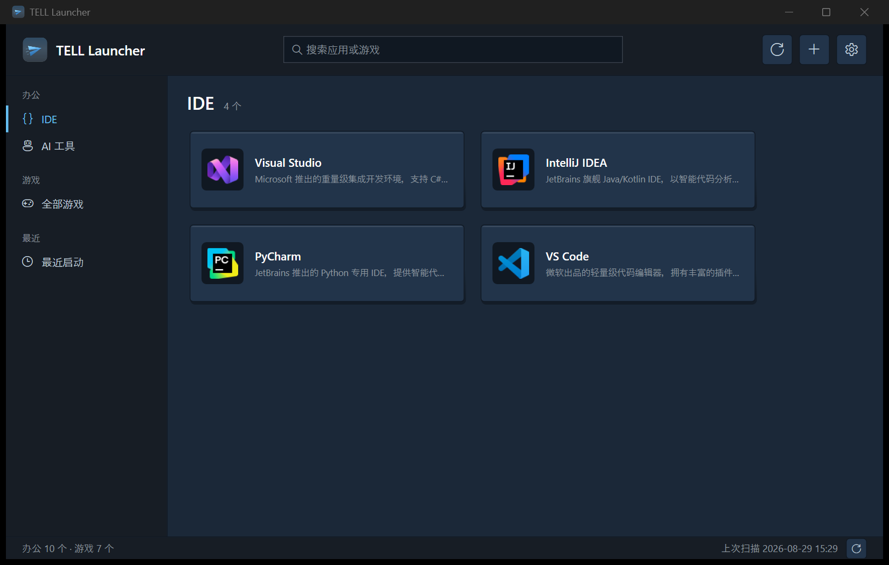

<div align="center">


# TELL 启动器

一款 Steam 风格暗色主题的 Windows 应用启动器,把常用的 IDE、AI 工具和游戏集中在一个窗口中,点击即开喵。

[](https://github.com/zhangTELL/TELL-Launcher/releases/latest)
[](LICENSE)
[](https://dotnet.microsoft.com/)

</div>

## 截图



## 功能特性

- **侧边栏导航**:IDE / AI 工具 / 全部游戏 / 最近启动 四个分组,图标 + 强调色竖条指示,一键切换喵
- **双形态卡片**:游戏竖版胶囊 / 应用横版卡,悬停阴影动效与启动脉冲反馈喵
- **Steam 游戏库**:自动解析 `appmanifest` 与 `libraryfolders.vdf`,识别已安装的 Steam 游戏喵
- **快捷方式扫描**:自动扫描桌面 `.lnk` / `.url` 快捷方式,支持去重与隐藏记忆;正确识别米哈游 HYP 等聚合启动器快捷方式的游戏本体图标喵
- **实时模糊搜索**:跨全部分组按名称模糊匹配喵
- **拖拽管理**:支持拖动排序、跨分组移动喵
- **应用详情页**:大图封面(自定义图片 → 游戏封面 → 图标 自动回退)、上次启动时间、一键复制路径喵
- **自动填充**:添加应用时自动识别名称与图标,并生成默认描述喵
- **本地优先**:所有配置保存在本地,无需登录、无需联网喵

## 下载安装

到 [Releases](https://github.com/zhangTELL/TELL-Launcher/releases/latest) 页面下载 `TELL-Launcher-vX.Y.Z-win-x64.exe`:

- 自包含单文件版,**无需安装 .NET 运行时**,下载后直接运行喵
- 程序未做代码签名,首次运行如遇 SmartScreen 提示,选择"更多信息 → 仍要运行"即可喵
- 卸载只需删除 exe 与配置目录 `%LocalAppData%\TELL Launcher\`

## 从源码构建

```bash
# 构建
dotnet build

# 发布(框架依赖版,输出到 publish/)
dotnet publish TELLLauncher/TELLLauncher.csproj -c Release -o publish

# 发布(自包含单文件版,无需 .NET 运行时)
dotnet publish TELLLauncher/TELLLauncher.csproj -c Release \
  -r win-x64 --self-contained true -p:PublishSingleFile=true \
  -p:IncludeNativeLibrariesForSelfExtract=true \
  -p:EnableCompressionInSingleFile=true -o publish/single-file
```

## 图标

应用图标的设计源在 `assets/icon.svg`,改完配色或形状后运行:

```bash
powershell -NoProfile -File assets/render-icon.ps1
```

即可一键重新生成 `TELLLauncher/app.png` 与多尺寸 `app.ico`,全程仅依赖系统自带的 GDI+,无需安装任何工具喵。

## 技术栈

| 项目 | 说明 |
| --- | --- |
| 框架 | .NET 8 + WPF |
| 语言 | C# |
| 架构 | MVVM(手写实现) |
| 存储 | JSON 配置文件,带备份轮转 |
| 测试 | xUnit |

## 目录结构

```text
TELL的启动器/
├── assets/               # 应用图标设计源(icon.svg)与渲染脚本(render-icon.ps1)
├── TELLLauncher/         # 应用本体
│   ├── Models/           # 数据模型(AppEntry / AppGroup / LauncherConfig)
│   ├── Services/         # 配置读写、程序定位、快捷方式扫描、图标提取、启动等
│   ├── ViewModels/       # 界面状态与交互逻辑
│   └── Views/            # 窗口与对话框(主窗口 / 详情页 / 编辑对话框 / Steam 库)
└── TELLLauncher.Tests/   # 单元测试
```

## 数据存储

配置保存在 `%LocalAppData%\TELL Launcher\config.json`,包括:

- 应用清单与自定义修改
- 手动添加的应用
- 游戏扫描结果与隐藏状态
- 分组归属与排序
- 自定义名称、图标、描述与程序路径

配置文件写入前会自动备份轮转,避免损坏丢失喵。

## SteamGridDB API

游戏封面使用了 [SteamGridDB](https://www.steamgriddb.com/) 的 API 补充获取喵。

## 测试

```bash
dotnet test
```

## 作者
zhang TELL/ Yoshinove

## 鸣谢

本项目由 AI 编程助手辅助开发,鸣谢以下 AI 模型提供的能力支持:

- **[DeepSeek](https://www.deepseek.com/)** — 主力代码生成、架构设计和功能迭代
- **[Kimi](https://kimi.moonshot.cn/)** — UI 设计优化、视觉方案建议
- **[Codex](https://openai.com/codex/)** — 代码生成与任务协作

## 许可证

[MIT](LICENSE)
